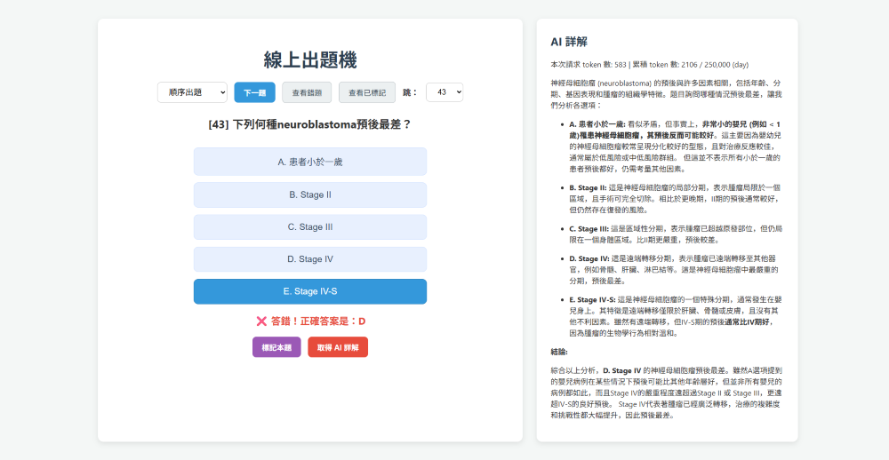

# 線上出題機

這是一個基於 Flask 的線上測驗應用程式，可以幫助你複習題庫。它提供了多種測驗模式（隨機、順序、錯題練習），並整合了 AI 詳解功能，提供更完整的學習體驗。



-----

## 主要功能

  * **多樣化的測驗模式**：
      * `隨機出題`：從題庫中隨機挑選題目。
      * `順序出題`：依照題號順序出題。
      * `錯題練習`：只練習你答錯過的題目。
  * **即時回饋**：提交答案後，會立即顯示對錯，並標示正確答案。
  * **AI 詳解**：點擊按鈕即可透過 Google Gemini AI 取得詳細的題目解釋，幫助你理解概念。
  * **錯題與標記追蹤**：
      * 系統會自動記錄你答錯的題目，方便日後進行錯題複習。
      * 你可以手動標記特別需要關注的題目。
  * **題號跳轉**：支援手動輸入題號，快速跳轉至特定題目。
  * **視覺化介面**：美觀且直觀的使用者介面，提供良好的測驗體驗。

-----

## 如何安裝與執行

### 前置條件

1.  **Python 3.x**：確保你的系統已安裝 Python。
2.  **pip**：Python 的套件管理工具。
3.  **Gemini API Key**：你需要從 [Google AI Studio](https://aistudio.google.com/app/apikey) 取得一個免費的 Gemini API Key。

### 設定步驟

1.  **複製專案**：

    ```bash
    git clone https://github.com/你的專案名稱/線上出題機.git
    cd 線上出題機
    ```

2.  **建立虛擬環境並安裝所需套件**：

    ```bash
    python -m venv venv
    # Windows
    venv\Scripts\activate
    # macOS / Linux
    source venv/bin/activate

    pip install Flask google-generativeai
    ```

3.  **設定環境變數**：
    為了安全地使用你的 Gemini API Key，請將其設為環境變數。

    **macOS / Linux**
    在終端機中執行：

    ```bash
    export GEMINI_API_KEY="你的API金鑰"
    ```

    **Windows (PowerShell)**
    在 PowerShell 中執行：

    ```powershell
    $env:GEMINI_API_KEY = "你的API金鑰"
    ```

4.  **準備題庫 (`data.json`)**：
    在專案根目錄下建立一個名為 `data.json` 的檔案，其格式如下：

    ```json
    [
      {
        "題號": "1",
        "題目": "以下哪一個是 Python 的關鍵字？",
        "選項": ["A. list", "B. class", "C. dict", "D. tuple"],
        "答案": "B"
      },
      {
        "題號": "2",
        "題目": "HTTP 協定的預設 Port 是？",
        "選項": ["A. 80", "B. 443", "C. 21", "D. 22"],
        "答案": "A"
      }
    ]
    ```

5.  **啟動應用程式**：
    在專案根目錄下執行：

    ```bash
    python quiz_web.py "data.json"
    ```

    然後打開你的瀏覽器，前往 `http://127.0.0.1:5000` 即可開始使用。

-----

## 專案結構

```
線上出題機/
├── app.py           # 伺服器後端程式
├── templates/
│   └── index.html   # 前端使用者介面
├── data.json        # 你的題庫檔案
└── README.md        # 專案說明文件
```
